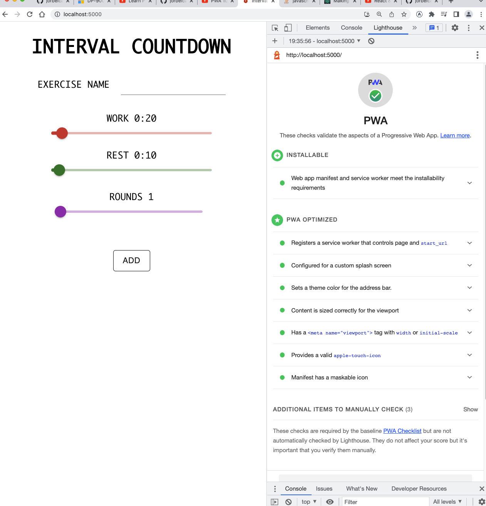

# Interval Countdown - Proyecto de Temporizador de Intervalos

## Descripción

Este proyecto es un **temporizador de intervalos** hecho en **React**, diseñado para ayudar a gestionar ejercicios basados en intervalos de trabajo y descanso. La aplicación te permite personalizar el nombre del ejercicio, los tiempos de trabajo, descanso y la cantidad de rondas que deseas realizar. Además, está optimizado como una **Progressive Web App (PWA)** y estará disponible en **GitHub Pages**.

## Características

- Personalización de intervalos:
  - Tiempo de trabajo
  - Tiempo de descanso
  - Número de rondas
- Diseño minimalista con **MaterialUI**
- Funcionalidad **offline** gracias a la tecnología **PWA**
- Instalación en dispositivos como una aplicación nativa



## Tecnologías Utilizadas

- **React**: Biblioteca de JavaScript para construir la interfaz de usuario.
- **MaterialUI**: Librería de componentes para un diseño estético y responsivo.
- **Progressive Web App (PWA)**: Permite instalar la aplicación y usarla sin conexión.
- **Lighthouse**: Herramienta para la auditoría de rendimiento y optimización de PWAs.

## Instalación y Uso Local

### Prerrequisitos

- **Node.js** (versión 14 o superior)
- **npm** o **yarn**

### Pasos para clonar el repositorio e instalar dependencias

1. Clona el repositorio:

   ```bash
   git clone https://github.com/tu-usuario/intervalCountdown-2.0.git
   ```

2. Navega al directorio del proyecto:

   ```bash
   cd intervalCountdown-2.0
   ```

3. Instala las dependencias:

   Con **npm**:

   ```bash
   npm install
   ```

   O con **yarn**:

   ```bash
   yarn install
   ```

### Ejecutar en modo desarrollo

Para ejecutar la aplicación en modo de desarrollo, utiliza el siguiente comando:

```bash
npm start
```

Luego, abre [http://localhost:3000](http://localhost:3000) en tu navegador para ver la aplicación.

## Progressive Web App (PWA)

Este proyecto está configurado como una **PWA**, lo que significa que puedes instalarlo como una aplicación nativa en tu dispositivo. Sigue estos pasos para instalarla:

1. Abre la aplicación en tu navegador (Chrome o Edge).
2. Haz clic en el icono de instalación que aparece en la barra de direcciones (un símbolo de "+" o "Instalar").
3. La aplicación se instalará en tu escritorio o menú de aplicaciones.

### Modo offline

Gracias a la implementación de un **service worker**, puedes utilizar la aplicación sin conexión a internet una vez que haya sido instalada o cargada en el navegador.

## Contribución

Si deseas contribuir al proyecto:

1. Haz un fork del repositorio.
2. Crea una rama con tu característica (`git checkout -b nueva-caracteristica`).
3. Realiza tus cambios y haz un commit (`git commit -m 'Agrega nueva característica'`).
4. Haz push a la rama (`git push origin nueva-caracteristica`).
5. Abre un **Pull Request**.

## Auditoría de Lighthouse

Este proyecto ha sido auditado con **Lighthouse** para asegurar una óptima performance como **PWA**. Algunas de las características evaluadas incluyen:

- Instalabilidad
- Registro de un service worker que controla la página
- Configuración correcta del splash screen
- Definición de iconos para la aplicación

## Licencia

Este proyecto está bajo la licencia MIT.
